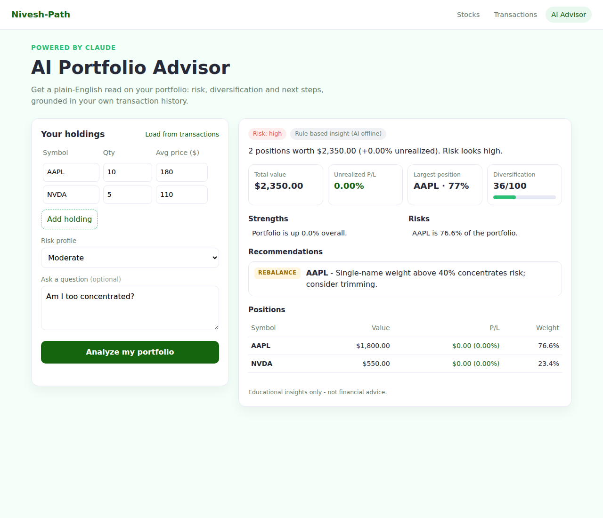

# Nivesh-Path - AI-Powered Investment Platform

[](https://github.com/sumitparmar19/Nivesh-Path/actions/workflows/ci.yml)

Nivesh-Path ("path to investment") is a full-stack stock-investing app. It shows live market
data for 12 US stocks, lets every user paper-trade with **$100,000 in virtual cash**, and has a
**Portfolio AI Advisor** that uses Claude and retrieval-augmented generation (RAG) to explain
your portfolio's risk, diversification and next steps.

> **Live demo:** _coming soon (DigitalOcean App Platform)_



## Features
- **Portfolio AI Advisor:** Claude (`claude-opus-5-5`) returns schema-validated insights: risk
  level, diversification score, strengths, risks, actionable recommendations, and answers to
  free-form questions.
- **RAG over your history:** every trade is embedded into ChromaDB. The advisor retrieves the
  most relevant past transactions before answering. MongoDB stays the source of truth: on cold
  start (every deploy) the AI service rebuilds ChromaDB from it, and behavioral-pattern results
  are stored in a `behavioral_patterns` collection.
- **Graceful degradation:** if the LLM is unavailable, a rule-based engine still returns a useful
  analysis, built on the same deterministic metrics (P/L, weights, HHI concentration).
- **Live quotes:** Finnhub data is proxied and cached in Redis, so the API key never reaches the
  browser.
- **Per-user paper trading:** JWT-protected accounts, each with an isolated portfolio and a $100k virtual
  cash ledger (atomic MongoDB `$inc`, server-side pricing, concurrency-safe buys and sells).
- **50+ stocks and ETFs, any US ticker:** Markets by sector, search, live quotes, key stats, company profile and news
  (Finnhub, cached server-side), watchlist synced to your account.
- **Everything saved to your account:** profile, theme, password, saved AI analyses, paper-account reset and account deletion.
- **Portfolio dashboard:** cash, holdings at live prices, allocation chart, P&L, recent trades and an
  "AI memory" panel that shows (and can re-sync) what the advisor remembers.
- **What's new page:** release notes with links to try each feature, plus live system status.
- **Auth:** bcrypt password hashing and JWT access tokens.
- **Production practices:** Docker Compose, GitHub Actions CI (Jest + pytest + image builds),
  Sentry error tracking, and rate limiting on the paid AI endpoint.

## Architecture
```
Browser -> Node/Express (:3000) -> MongoDB, Redis, Finnhub
                                 -> FastAPI AI service (:8001) -> ChromaDB + Claude API
```
See [architecture.md](architecture.md) for the diagrams and the request flow.

| Layer | Tech |
|---|---|
| Frontend | HTML, CSS, JavaScript with a shared design system (React + TypeScript + Tailwind migration: Phase 2B) |
| Backend | Node.js 22, Express, Mongoose, Redis, JWT |
| AI service | Python 3.11, FastAPI, LangChain, Anthropic SDK, ChromaDB, Pydantic |
| DevOps | Docker, Docker Compose, GitHub Actions, GHCR, DigitalOcean App Platform, Sentry |
| Testing | Jest + Supertest, pytest |

## Run locally

**Option A: Docker (everything in one command)**
```bash
cp .env.example .env        # add your MongoDB, Finnhub and Anthropic keys
docker compose up --build   # http://localhost:3000  (AI Advisor: /advisor.html)
```

**Option B: run each service yourself**
```bash
# AI service
cd ai-service
python -m venv .venv && source .venv/bin/activate
pip install -r requirements-dev.txt
uvicorn main:app --port 8001

# Backend (new terminal, repo root)
npm install
npm run dev
```

## Tests
```bash
npm test                      # backend: 69 Jest/Supertest tests
cd ai-service && pytest -q    # AI service: 23 pytest tests (Claude mocked, Chroma in-memory, mongomock)
```

## API highlights
| Method | Path | Description |
|---|---|---|
| POST | `/api/ai/analyze-portfolio` | AI analysis; uses stored holdings if none are sent |
| GET | `/api/portfolio/holdings` | Holdings derived from transactions |
| GET | `/search`, `/stock/:symbol` | Cached live quotes |
| POST | `/api/store-purchase` | Buy/sell with virtual cash `{symbol, quantity, price, type}` (auth) |
| GET | `/api/transactions` · `/api/portfolio/holdings` · `/api/portfolio/cash-balance` | Your trades, holdings, cash and P&L (auth) |
| POST | `/api/register` · `/api/login` · GET `/api/me` | Auth (JWT) |

The AI service has interactive docs at `http://localhost:8001/docs`.

## Deploy (DigitalOcean, GitHub Student Pack)
Full step-by-step guide, including where to get every key: [docs/DEPLOYMENT.md](docs/DEPLOYMENT.md).

1. Create a free MongoDB Atlas cluster and copy its connection string.
2. In DigitalOcean go to **Apps → Create App → Import from app spec**, and upload `.do/app.yaml`.
3. Fill in the secrets: `MONGO_URL`, `FINNHUB_API_KEY`, `JWT_SECRET`,
   `ANTHROPIC_API_KEY`, and optionally `SENTRY_DSN`.
4. Every push to `main` redeploys automatically.

---
Built by **Sumit Parmar**. Insights are educational, not financial advice.
