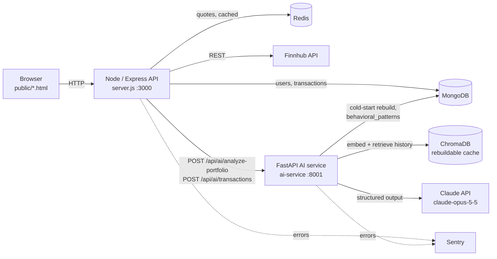
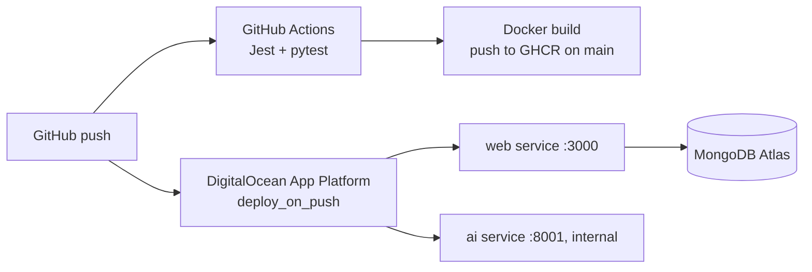

# Nivesh-Path Architecture

## Portfolio AI Advisor - request flow

1. The user opens `advisor.html`. It loads holdings from `GET /api/portfolio/holdings`, which nets
   buy/sell transactions in MongoDB into positions with an average cost.
2. Clicking **Analyze** posts the holdings, a risk profile and an optional question to the Node API.
3. Node adds live prices (Finnhub via the Redis cache), then forwards the request to the AI service.
   The route is rate-limited because every call costs LLM tokens.
4. The AI service:
   - computes metrics in Python: P/L, weights, HHI concentration. The LLM never does arithmetic.
   - retrieves the user's most relevant past transactions from ChromaDB (RAG).
   - builds the prompt with a LangChain `ChatPromptTemplate` and calls Claude through the
     Anthropic SDK, with structured outputs validated against the `AIInsight` Pydantic schema.
   - if Claude is unavailable (no key, outage, rate limit, refusal), returns a rule-based
     insight instead, so the page always works.
5. Each new purchase (`POST /store-purchase`) is also sent to `POST /api/ai/transactions`
   and embedded into ChromaDB. That gives later analyses more history to draw on.

## Persistence: why ChromaDB can be thrown away

DigitalOcean App Platform wipes the container filesystem on every deploy, so ChromaDB is only a
cache. MongoDB Atlas is the source of truth:

- On boot, `ai-service/startup.py` re-embeds every user's trades from the `purchases` collection
  into their own Chroma collection (background thread; progress on the AI service's `/health`).
- If a user's collection is still missing when they ask the advisor, it is rebuilt for that user
  on the spot.
- Behavioral-pattern results (panic sells, FOMO buys, holding periods) are stored as documents in
  MongoDB's `behavioral_patterns` collection, never only in Chroma.

## Deployment

